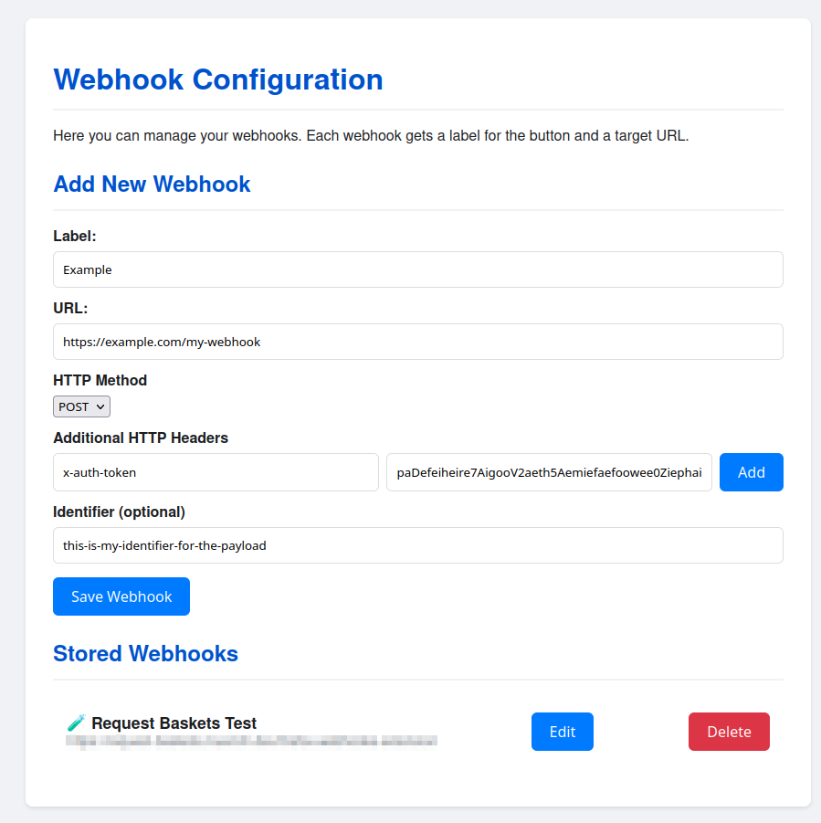
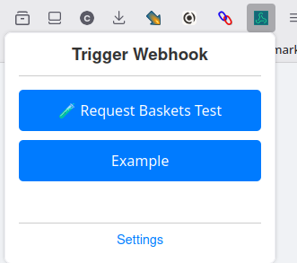

# muench-dev Webhook Trigger Browser Extension

This browser extension allows you to manage and trigger webhooks directly from your browser. It is designed for users who want to quickly send HTTP requests (webhooks) to custom endpoints, such as automation services, APIs, or personal scripts. The extension is compatible with both Firefox and Chrome browsers.

## Features

- **Manage Webhooks**: Add, edit, and remove webhook URLs from the extension options page.
- **Trigger Webhooks**: Quickly trigger any configured webhook from the popup menu.
- **Customizable**: Supports multiple webhooks with custom names and endpoints.
- **Persistent Storage**: All webhooks are stored locally in your browser and persist across sessions.
- **Localization**: Available in multiple languages (see `_locales/`).

## Getting Started

1. **Install the Extension**
   - **Firefox**: Load the extension in Firefox via `about:debugging` or package and install it from the [Add-ons Manager](about:addons).
   - **Chrome**: Load the extension in Chrome via `chrome://extensions` in developer mode by clicking "Load unpacked" and selecting the extension directory.

2. **Open the Options Page**
   - Right-click the extension icon and select "Options" (Firefox) or "Extension options" (Chrome), or open it from the extension's popup menu.

## Managing Webhooks



### Add a Webhook
1. Go to the options page (`Options` in the extension menu).
2. Enter a name and the webhook URL in the provided fields.
3. Click the "Add" button to save the webhook.

### Edit a Webhook
1. On the options page, find the webhook you want to edit.
2. Click the "Edit" button next to the webhook.
3. Update the name or URL as needed.
4. Click "Save" to apply changes.

### Delete a Webhook
1. On the options page, find the webhook you want to remove.
2. Click the "Delete" button next to the webhook.

## Triggering Webhooks



1. Click the extension icon in the browser toolbar to open the popup.
2. Select the webhook you want to trigger from the list.
3. Click the "Send" or equivalent button to trigger the webhook.

## Localization

- The extension supports multiple languages. To contribute translations, edit the files in the `_locales/` directory.

## Development

- All source code is located in the respective folders:
  - `options/` for the options page
  - `popup/` for the popup UI
  - `utils/` for utility functions and browser abstraction
  - `_locales/` for translations

### Browser Compatibility

This extension supports both Firefox and Chrome through a browser abstraction layer:

- `utils/browser-polyfill.js` provides a unified API that works across browsers
- `manifest.chrome.json` contains Chrome-specific settings
- `manifest.firefox.json` contains Firefox-specific settings
- `manifest.json` should be replaced with the appropriate browser-specific manifest file before building

### Building for Different Browsers

The extension includes separate manifest files for each browser:
- `manifest.firefox.json` - Contains Firefox-specific settings
- `manifest.chrome.json` - Contains Chrome-specific settings
- `manifest.json` - The active manifest file used for building

#### For Firefox:
1. Copy `manifest.firefox.json` to `manifest.json`:
   ```
   cp manifest.firefox.json manifest.json
   ```
2. Package the extension using web-ext:
   ```
   npx web-ext build
   ```

#### For Chrome:
1. Copy `manifest.chrome.json` to `manifest.json`:
   ```
   cp manifest.chrome.json manifest.json
   ```
2. Package the extension using Chrome's extension tools or zip the directory:
   ```
   zip -r webhook-trigger-chrome.zip * -x "*.git*" -x "web-ext-artifacts/*" -x "manifest.firefox.json"
   ```

The browser abstraction layer automatically detects which browser is being used and provides the appropriate implementations for browser APIs.

## License

This project is licensed under the MIT License.
