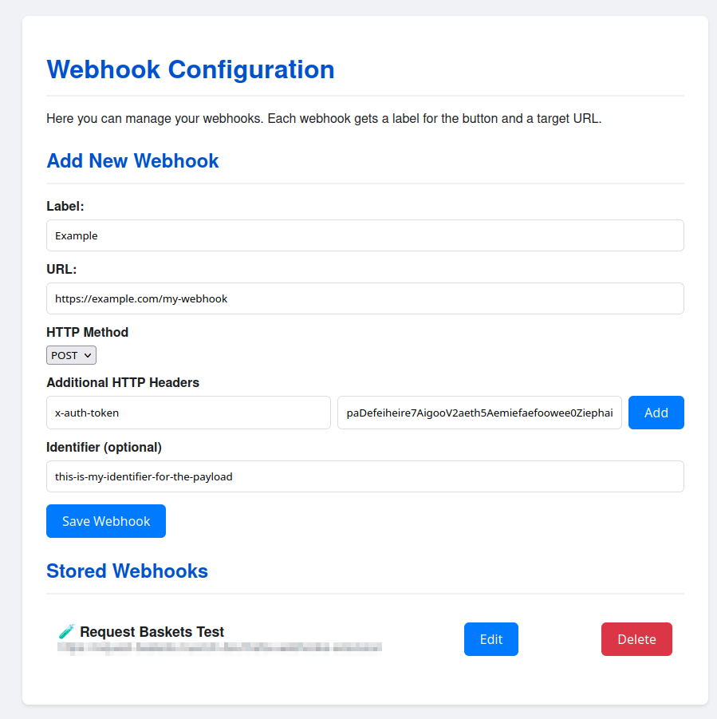
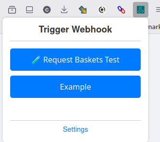

# muench-dev Webhook Trigger Browser Extension

This browser extension allows you to manage and trigger webhooks directly from your browser. It works with both Firefox and Chrome. It is designed for users who want to quickly send HTTP requests (webhooks) to custom endpoints, such as automation services, APIs, or personal scripts.

## Features

- **Manage Webhooks**: Add, edit, and remove webhook URLs from the extension options page.
- **Trigger Webhooks**: Quickly trigger any configured webhook from the popup menu.
- **Customizable**: Supports multiple webhooks with custom names and endpoints.
- **Persistent Storage**: All webhooks are stored locally in your browser and persist across sessions.
- **Localization**: Available in multiple languages (see `_locales/`).

## Getting Started

1. **Install the Extension**
   - **Firefox**: Load the extension in Firefox via `about:debugging` or package and install it from the [Add-ons Manager](about:addons).
   - **Chrome**: Load the extension in Chrome via `chrome://extensions` in developer mode by clicking "Load unpacked" and selecting the extension directory.

2. **Open the Options Page**
   - Right-click the extension icon and select "Options", or open it from the extension's popup menu.

## Managing Webhooks

### Add a Webhook
1. Go to the options page (`Options` in the extension menu).
2. Enter a name and the webhook URL in the provided fields.
3. Click the "Add" button to save the webhook.

### Edit a Webhook
1. On the options page, find the webhook you want to edit.
2. Click the "Edit" button next to the webhook.
3. Update the name or URL as needed.
4. Click "Save" to apply changes.

### Delete a Webhook
1. On the options page, find the webhook you want to remove.
2. Click the "Delete" button next to the webhook.

## Triggering Webhooks

1. Click the extension icon in your browser's toolbar to open the popup.
2. Select the webhook you want to trigger from the list.
3. Click the "Send" or equivalent button to trigger the webhook.

## Localization

- The extension supports multiple languages. To contribute translations, edit the files in the `_locales/` directory.

## Development

- All source code is located in the respective folders:
  - `options/` for the options page
  - `popup/` for the popup UI
  - `_locales/` for translations
- The manifest file is `manifest.json`.

## License

This project is licensed under the MIT License.
